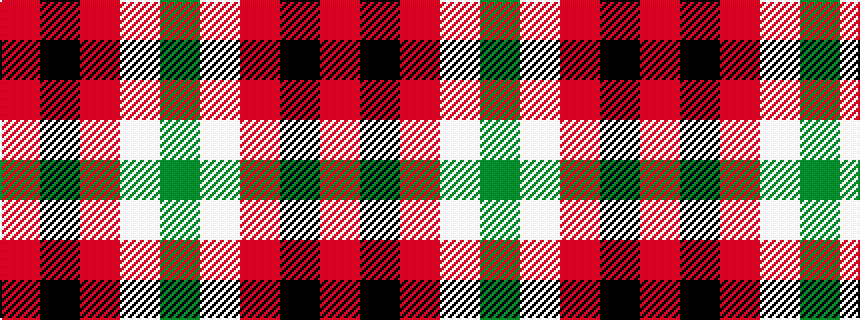

GWRKR

It is a 5 stripe tartan.

<figure class="pat-woven">

<figcaption>idealised sample</figcaption>
</figure>

## Colour Sequence



## Tartans with this colour sequence

| Tartans |
|---------------|
| [Unidentified item](/variants/s5/dg9w1r9k9r9~x8/)|
||
| [Unidentified, item](/variants/s5/r9k9r9w1g9~x8/)|
||
