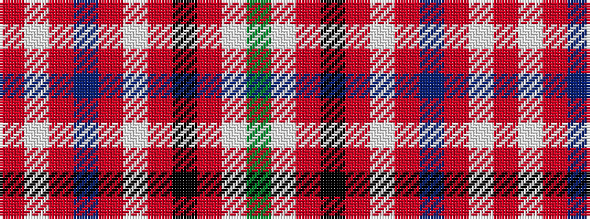

GWRKRWRBRWR

It is a 11 stripe tartan.

<figure class="pat-woven">

<figcaption>idealised sample</figcaption>
</figure>

## Colour Sequence



## Tartans with this colour sequence

| Tartans |
|---------------|
| [MacKellar Dress Red](/setts/s11/r27w2r3p4r3w2r5k13r2w26dg3~x2/)|
||
