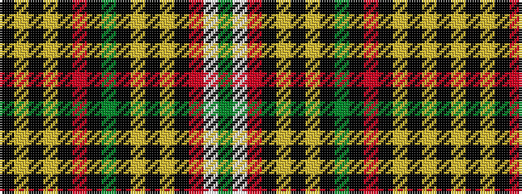

GWRKYKYKGKRKYKYK

It is a 16 stripe tartan.

<figure class="pat-woven">

<figcaption>idealised sample</figcaption>
</figure>

## Colour Sequence



## Tartans with this colour sequence

| Tartans |
|---------------|
| [Goldstraw (Name)](/variants/s16/g5w2r8k2lo4k2ly2k7g40k3r10k6lo7k7ly2k2~x2/)|
||
