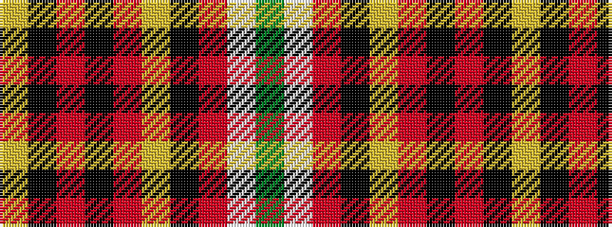

GWRKYRKRKY

It is a 10 stripe tartan.

<figure class="pat-woven">

<figcaption>idealised sample</figcaption>
</figure>

## Colour Sequence



## Tartans with this colour sequence

| Tartans |
|---------------|
| [Haileybury Pipe Band (Corporate)](/setts/s10/ly4k30o30k2o2ly2k2o5w5g2~x2/)|
||
