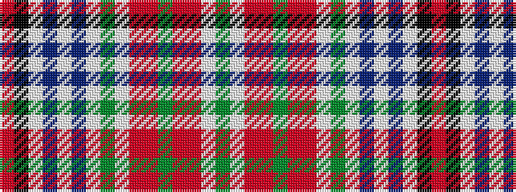

GWRRGRRWGWBWBWKR

It is a 16 stripe tartan.

<figure class="pat-woven">

<figcaption>idealised sample</figcaption>
</figure>

## Colour Sequence



## Tartans with this colour sequence

| Tartans |
|---------------|
| [MacBean Dress](/setts/s16/g10w4r4ri4g2ri4r4w4g10w4t4w2t4w23k2r2~x2/)|
||
| [MacBean dress](/setts/s16/g10w4r4m4g2m4r4w4g10w4t4w2t4w23k2r2~x2/)|
||
