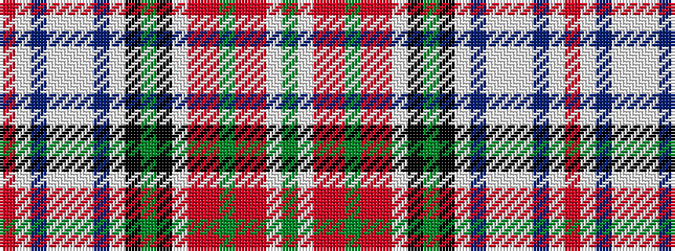

GWRRGRRWKGKWBWWWBWR

It is a 19 stripe tartan.

<figure class="pat-woven">

<figcaption>idealised sample</figcaption>
</figure>

## Colour Sequence



## Tartans with this colour sequence

| Tartans |
|---------------|
| [MacBean](/variants/s19/r24lb1db2lbi1lb1lbi1db2lb1k1dg6k1lb1r2ri2dg1ri2r2lb1dg3/)|
||
