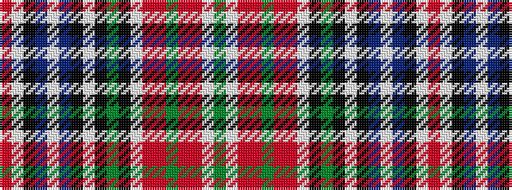

GWRRGRRWKGKWKBWBKWR

It is a 19 stripe tartan.

<figure class="pat-woven">

<figcaption>idealised sample</figcaption>
</figure>

## Colour Sequence



## Tartans with this colour sequence

| Tartans |
|---------------|
| [MacBean (1847)](/setts/s19/r57w2k4db2w2db2k2w2k2g10k2w2r4m4g2m4r4w2g7~x2/)|
||
| [MacBean Clan Tartan Tartan Number: 952. Earliest known date: pre 1963 The MacBains are closely associated with Mackintosh and this is apparent in the design of the tartan. A slightly different version is recorded by Lord Lyon (P.R.A. 43/108 - 8th March 1960) under the name MacBain. This version is available from the House of Edgar Old and Rare range. See products available Copyright © Blair Urquhart, Comrie, 2015](/setts/s19/r57w2k4db2w2db2k2w2k2g10k2w2r4r4g2r4r4w2g7~x2/)|
||
