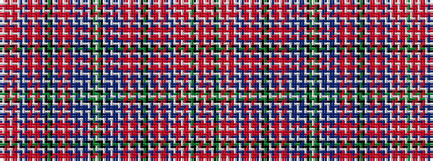

GWRRWRRWBWBRRWRRBWKGKWBRRWRRBWBBWBBWKGWGKWBBWBBWBRRWRRBWKGKWBRRWRRBWBWRRWRRWGKWRRW

It is a 82 stripe tartan.

<figure class="pat-woven">

<figcaption>idealised sample</figcaption>
</figure>

## Colour Sequence



## Tartans with this colour sequence

| Tartans |
|---------------|
| [Aberdeen](/setts/s82/g4w1r6m3w1m3r6w1t10w2dp3r8m3w2m3r8dp3w2k12g4k12w2dp3r8m3w2m3r8dp3w2dp6t4w2t4dp6w2k16g4w2g4k16w2dp6t4w2t4dp6w2dp3r8m3w2m3r8dp3w2k12g4k12w2dp3r8m3w2m3r8dp3w2t10w1r6m3w1m3r6w1g4k16w2r23m3w2~x2/)|
||
