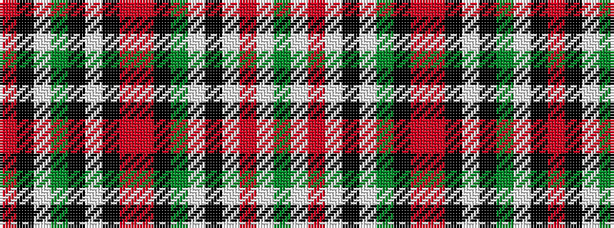

GWRWKWGKRRKWKGWKR

It is a 17 stripe tartan.

<figure class="pat-woven">

<figcaption>idealised sample</figcaption>
</figure>

## Colour Sequence



## Tartans with this colour sequence

| Tartans |
|---------------|
| [Sabrettes](/variants/s17/r15k5w2y7k4w8k2r5r21k5y2w2k7w2r5w2g2~x2/)|
||
