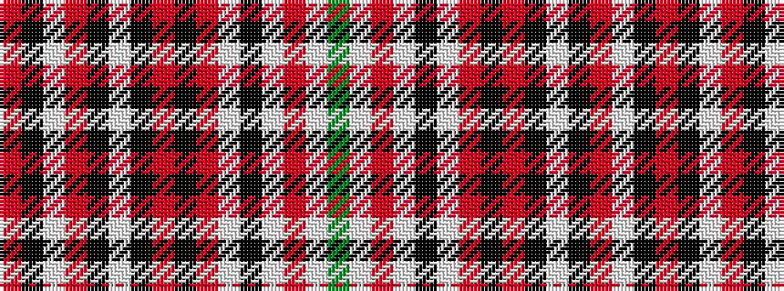

GWRWKWRKRKWKRWKR

It is a 16 stripe tartan.

<figure class="pat-woven">

<figcaption>idealised sample</figcaption>
</figure>

## Colour Sequence



## Tartans with this colour sequence

| Tartans |
|---------------|
| [Sabrettes (Corporate)](/setts/s16/r15k5w2o7k4w8k2r26k5o2w2k7w2r5w2g2~x2/)|
||
