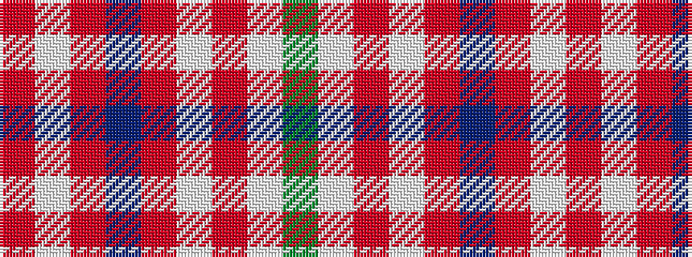

GWRWRBRWR

It is a 9 stripe tartan.

<figure class="pat-woven">

<figcaption>idealised sample</figcaption>
</figure>

## Colour Sequence



## Tartans with this colour sequence

| Tartans |
|---------------|
| [Ailsa, Grey (Fashion)](/variants/s9/o9w9o9n25o1w1o1w1g3~x2/)|
||
