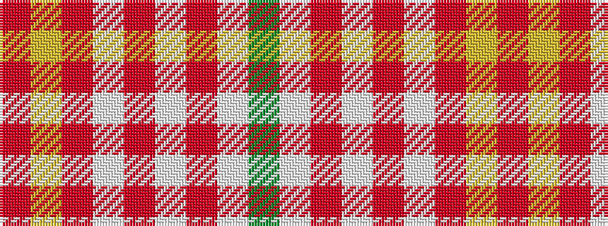

GWRWRWRYR

It is a 9 stripe tartan.

<figure class="pat-woven">

<figcaption>idealised sample</figcaption>
</figure>

## Colour Sequence



## Tartans with this colour sequence

| Tartans |
|---------------|
| [Karibu](/variants/s9/g12w1r1w4r1w1r8ly2r1~x4/)|
||
