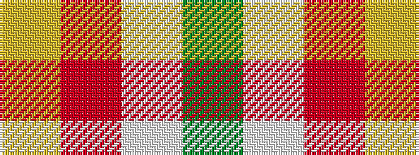

GWRY

It is a 4 stripe tartan.

<figure class="pat-woven">

<figcaption>idealised sample</figcaption>
</figure>

## Colour Sequence



## Tartans with this colour sequence

| Tartans |
|---------------|
| [Loch Lomond](/setts/s4/g22w14r7ly1~x2/)|
||
| [Loch Lomond #3](/setts/s4/g22w14r7ly2~x2/)|
||
