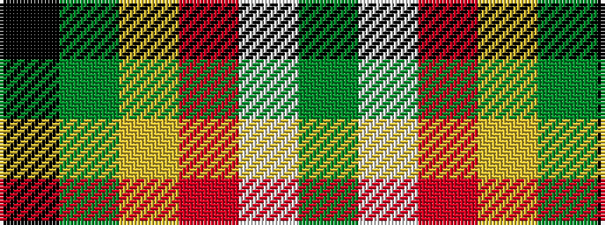

GWRYGK

It is a 6 stripe tartan.

<figure class="pat-woven">

<figcaption>idealised sample</figcaption>
</figure>

## Colour Sequence



## Tartans with this colour sequence

| Tartans |
|---------------|
| [Asheville Firefighters, The](/setts/s6/k17dg48ly4r10lb12dg4/)|
||
