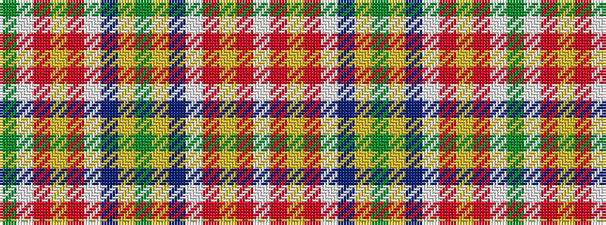

GWRYRWBYGYBWRYRW

It is a 16 stripe tartan.

<figure class="pat-woven">

<figcaption>idealised sample</figcaption>
</figure>

## Colour Sequence



## Tartans with this colour sequence

| Tartans |
|---------------|
| [Satchidananda (Personal)](/setts/s16/dy18ly4t10w2r20ly5r2w2dy6~x2/)|
||
