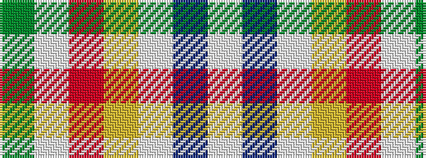

GWRYWBW

It is a 7 stripe tartan.

<figure class="pat-woven">

<figcaption>idealised sample</figcaption>
</figure>

## Colour Sequence



## Tartans with this colour sequence

| Tartans |
|---------------|
| [de Meuron Dress (Family)](/variants/s7/lb40dp5lb6ly26o13lb9dy3~x2/)|
||
