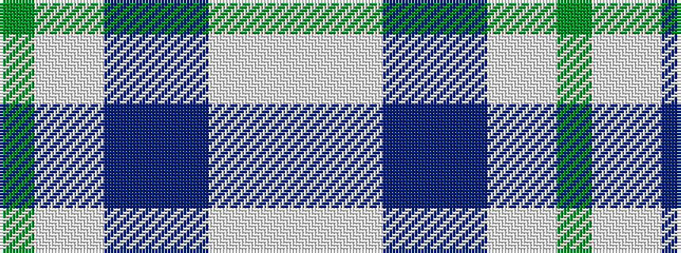

GWWBBBWWW

It is a 9 stripe tartan.

<figure class="pat-woven">

<figcaption>idealised sample</figcaption>
</figure>

## Colour Sequence



## Tartans with this colour sequence

| Tartans |
|---------------|
| [JMAR Unlimited](/setts/s9/g6w1lb3t6b12b15lp3w1lb1~x2/)|
||
