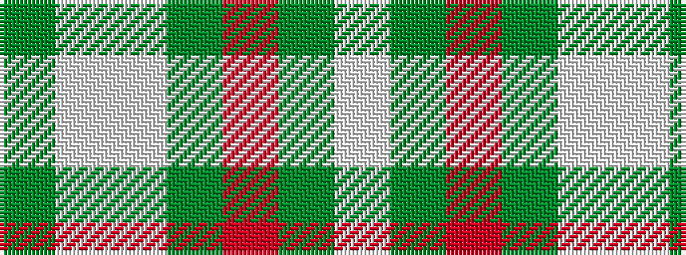

GWWGRGW

It is a 7 stripe tartan.

<figure class="pat-woven">

<figcaption>idealised sample</figcaption>
</figure>

## Colour Sequence



## Tartans with this colour sequence

| Tartans |
|---------------|
| [Jones (2016)](/setts/s7/dy1w2lb16dy8o16dy2w1~x2/)|
||
