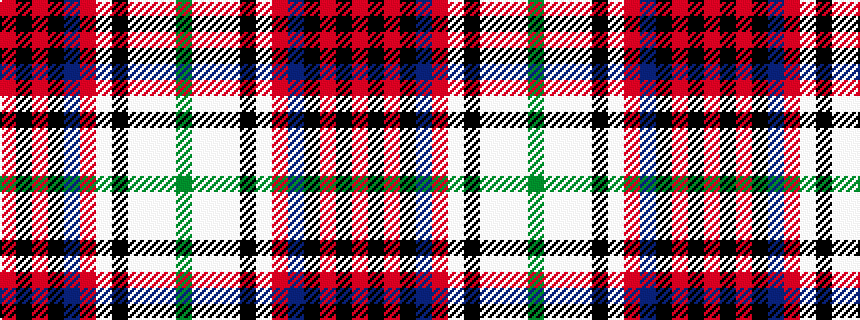

GWWWKWRBKRKR

It is a 12 stripe tartan.

<figure class="pat-woven">

<figcaption>idealised sample</figcaption>
</figure>

## Colour Sequence



## Tartans with this colour sequence

| Tartans |
|---------------|
| [Edinburgh Zoo Panda (Comm)](/variants/s12/g4w28lb3w3k16lb4o10n4k14r2k2r3/)|
||
