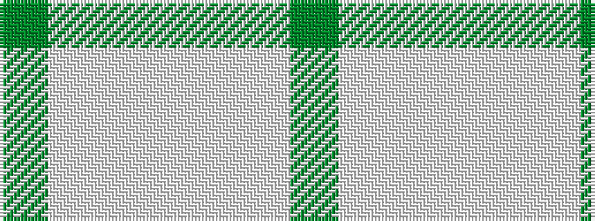

GWWWWWG

It is a 7 stripe tartan.

<figure class="pat-woven">

<figcaption>idealised sample</figcaption>
</figure>

## Colour Sequence



## Tartans with this colour sequence

| Tartans |
|---------------|
| [Highlands Country Club (Corporate)](/variants/s7/g5lbi15lb11lbi2lb1lbi1g4~x4/)|
||
