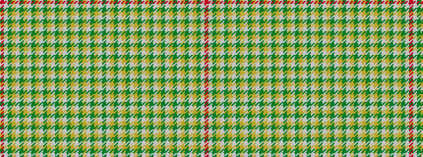

GWYGWYGWYGWYGWYGWYGWYGWYGWR

It is a 27 stripe tartan.

<figure class="pat-woven">

<figcaption>idealised sample</figcaption>
</figure>

## Colour Sequence



## Tartans with this colour sequence

| Tartans |
|---------------|
| [Glenmoidart](/variants/s27/dy2w3lo2dy2w3lo2dy2w3lo2dy2w3lo2dy2w3lo2dy2w3lo2dy2w3lo2dy2w3lo2dy2w3r2~x2/)|
||
