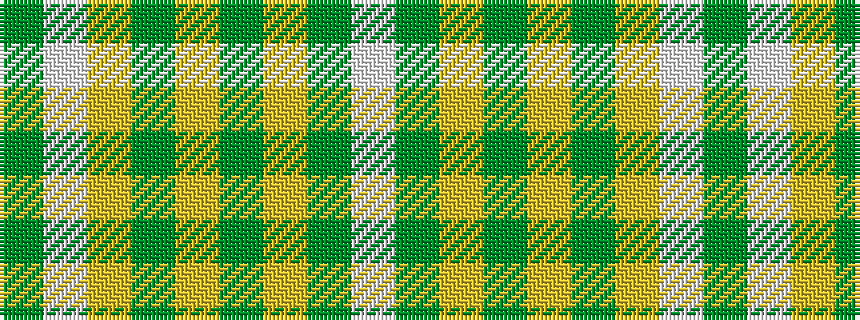

GWYGYGYGW

It is a 9 stripe tartan.

<figure class="pat-woven">

<figcaption>idealised sample</figcaption>
</figure>

## Colour Sequence



## Tartans with this colour sequence

| Tartans |
|---------------|
| [KIltwalk, The (Corporate)](/setts/s9/dy2lb2lo4dy5lo5dy46lo7dy1w2~x2/)|
||
