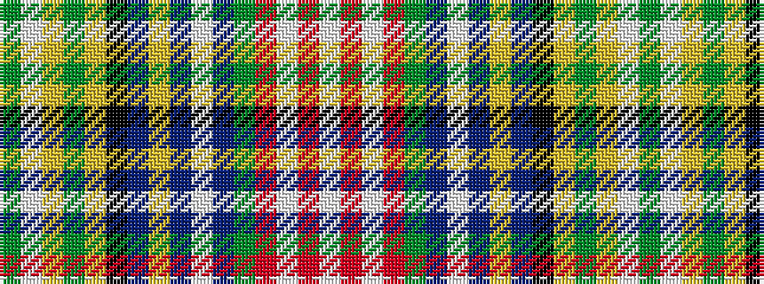

GWYGYKBYBWBGRWRW

It is a 16 stripe tartan.

<figure class="pat-woven">

<figcaption>idealised sample</figcaption>
</figure>

## Colour Sequence



## Tartans with this colour sequence

| Tartans |
|---------------|
| [Zinnen of Scene (Luxembourg) (Personal)](/variants/s16/dg32w2ly2dy2ly6k2db6ly2db2w2db2dg10r5w2r4w2~x2/)|
||
