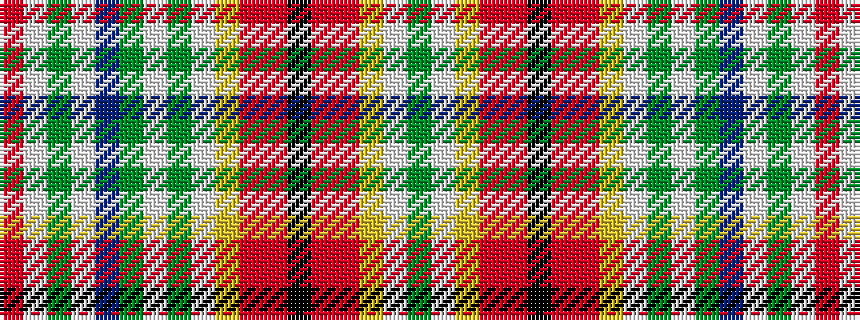

GWYRRKRRYWGWGBWGWR

It is a 18 stripe tartan.

<figure class="pat-woven">

<figcaption>idealised sample</figcaption>
</figure>

## Colour Sequence



## Tartans with this colour sequence

| Tartans |
|---------------|
| [New Loudoun](/setts/s18/r50w2dy5lt2db2dy5w2dg12w2lr2r2r5k2r5r2lr2w2dy9~x2/)|
||
