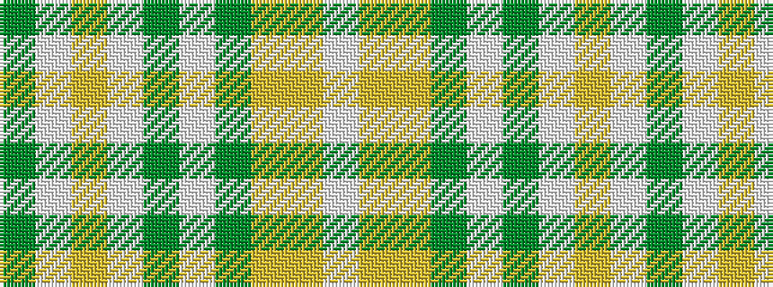

GWYWGWGYYW

It is a 10 stripe tartan.

<figure class="pat-woven">

<figcaption>idealised sample</figcaption>
</figure>

## Colour Sequence



## Tartans with this colour sequence

| Tartans |
|---------------|
| [Llama (Fashion)](/variants/s10/y2w19lr2w2y3w3y3lr6ly25w2~x2/)|
||
