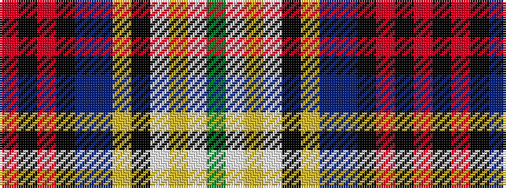

GWYWKYBBKRKR

It is a 12 stripe tartan.

<figure class="pat-woven">

<figcaption>idealised sample</figcaption>
</figure>

## Colour Sequence



## Tartans with this colour sequence

| Tartans |
|---------------|
| [Edinburgh Zoo Panda, The](/setts/s12/g4w28lr3w3k16lr4n10do4k14r2k2r3/)|
||
