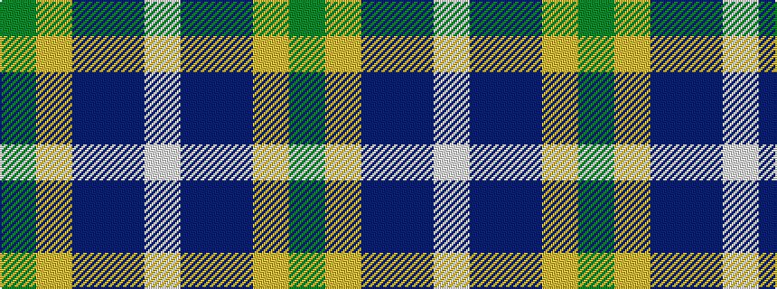

GYBBW

It is a 5 stripe tartan.

<figure class="pat-woven">

<figcaption>idealised sample</figcaption>
</figure>

## Colour Sequence



## Tartans with this colour sequence

| Tartans |
|---------------|
| [Sterling (Name)](/variants/s5/g11lo10dt11b33w3~x2/)|
||
| [Sterling, Rob (Florida) (Persona Name Tartan](/variants/s5/g11lo10dp11t33w3~x2/)|
||
| [Sterling, Rob (Florida) (Personal)](/variants/s5/g11lo10dp11b33w3~x2/)|
||
