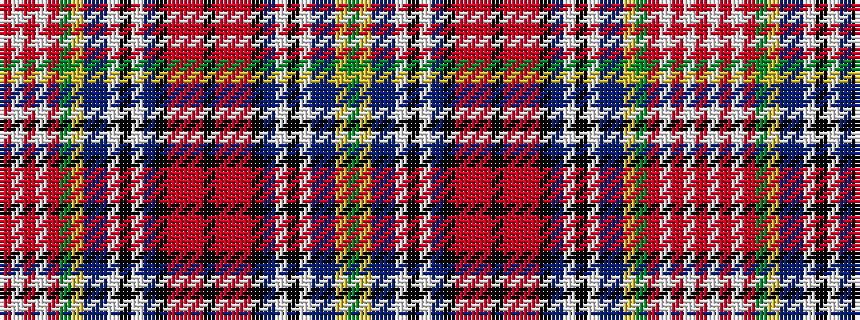

GYBBWKWBKRRRKRRRKBWKWBBYGRWRWR

It is a 30 stripe tartan.

<figure class="pat-woven">

<figcaption>idealised sample</figcaption>
</figure>

## Colour Sequence



## Tartans with this colour sequence

| Tartans |
|---------------|
| [Unidentified Cant #01 (Cumming)](/variants/s30/dg18ly3db14t6w3k2w3t6k2r4m3ri4k2ri4m3r2k2t6w3k2w3t6db14ly3dg18r12w3r12w3r12~x2/)|
||
