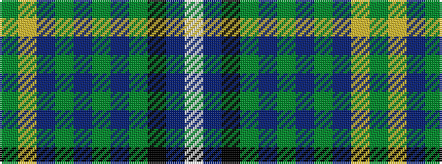

GYBGBGBGKBW

It is a 11 stripe tartan.

<figure class="pat-woven">

<figcaption>idealised sample</figcaption>
</figure>

## Colour Sequence



## Tartans with this colour sequence

| Tartans |
|---------------|
| [Lang of Sherbrooke (Personal)](/setts/s11/g10ly2dp2g2dp13g2dp2g1k13db24w2~x2/)|
||
