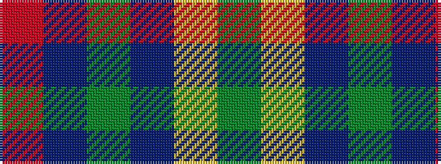

GYBGBR

It is a 6 stripe tartan.

<figure class="pat-woven">

<figcaption>idealised sample</figcaption>
</figure>

## Colour Sequence



## Tartans with this colour sequence

| Tartans |
|---------------|
| [Dunbog Primary (School)](/setts/s6/r12db3g5db16ly2g2~x2/)|
||
| [Dunbog Primary School Corporate Tartan Tartan Number: 954. Earliest known date: 1985 C. Armstrong is a pupil at the school. See products available Copyright © Blair Urquhart, Comrie, 2015](/setts/s6/r12dbi3g5db16ly2g2~x2/)|
||
| [Dunbog, Primary School](/setts/s6/r12db3g5dbi16ly2g2~x2/)|
||
