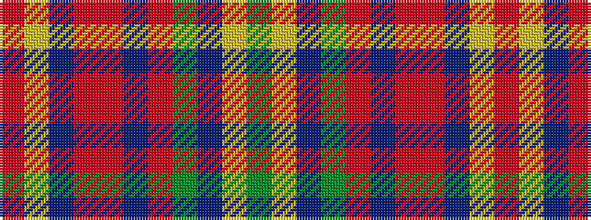

GYBGRBRRBYR

It is a 11 stripe tartan.

<figure class="pat-woven">

<figcaption>idealised sample</figcaption>
</figure>

## Colour Sequence



## Tartans with this colour sequence

| Tartans |
|---------------|
| [Scotland (Personal)](/variants/s11/r3ly1dp1r20ri2dp9ri2g20dp1ly1g3~x2/)|
||
