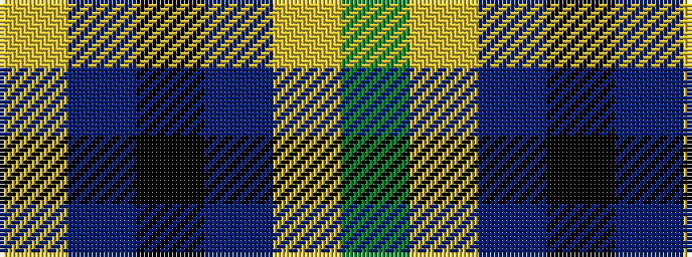

GYBKBY

It is a 6 stripe tartan.

<figure class="pat-woven">

<figcaption>idealised sample</figcaption>
</figure>

## Colour Sequence



## Tartans with this colour sequence

| Tartans |
|---------------|
| [Cala Homes (Corporate)](/variants/s6/ly5db24k8dbi18ly6dy3/)|
||
