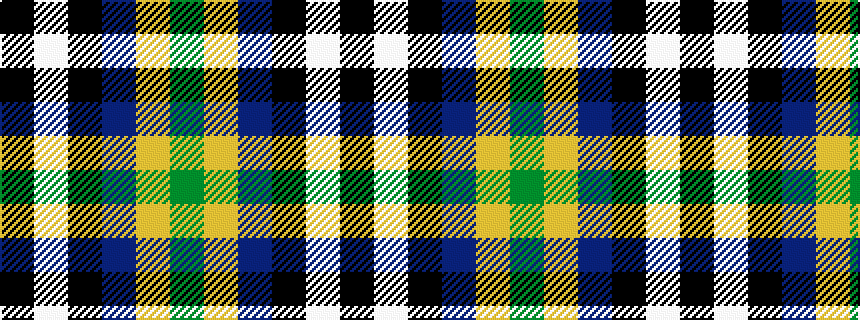

GYBKWK

It is a 6 stripe tartan.

<figure class="pat-woven">

<figcaption>idealised sample</figcaption>
</figure>

## Colour Sequence



## Tartans with this colour sequence

| Tartans |
|---------------|
| [Bryan Wedding (Personal)](/variants/s6/dy30ly5b10k10w2k2~x2/)|
||
| [Bryan Wedding (Personal)](/variants/s6/dy30ly5t10k10w2k2~x2/)|
||
