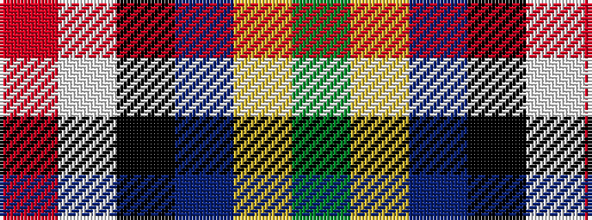

GYBKWR

It is a 6 stripe tartan.

<figure class="pat-woven">

<figcaption>idealised sample</figcaption>
</figure>

## Colour Sequence



## Tartans with this colour sequence

| Tartans |
|---------------|
| [Gordon of Abergeldie (Portrait)](/setts/s6/r63w4k4dp18ly4dg50~x2/)|
||
| [Gordon of Abergeldie, (Red..)](/setts/s6/r20w1k1dp6ly1g18~x2/)|
||
