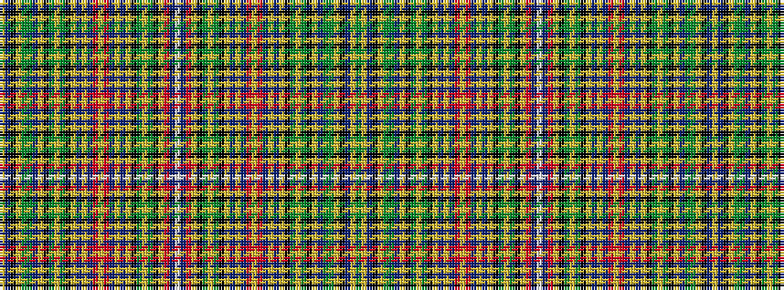

GYBKYGGBYKGYGKYBYBRYRBYBYKGYGKYRBWBRYKGYGKYBYBRYRBYBYKGYGKYBGGYKBY

It is a 66 stripe tartan.

<figure class="pat-woven">

<figcaption>idealised sample</figcaption>
</figure>

## Colour Sequence



## Tartans with this colour sequence

| Tartans |
|---------------|
| [Hebrides, Inner #01](/setts/s66/g3ly1db2k3ly1g4gi5db8ly1k2gi3ly1gi3k2ly1db22ly1db4r4ly1r4db4ly1db22ly1k2gi3ly1gi3k2ly1r14t6w1~x2/)|
||
