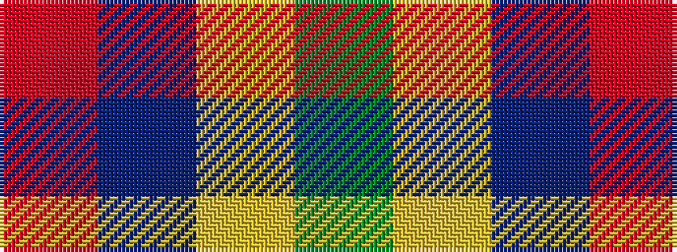

GYBR

It is a 4 stripe tartan.

<figure class="pat-woven">

<figcaption>idealised sample</figcaption>
</figure>

## Colour Sequence



## Tartans with this colour sequence

| Tartans |
|---------------|
| [Dohmen (Personal)](/setts/s4/g30ly3db8r25~x2/)|
||
| [Dohmen Family (Zuid-Nederland)](/setts/s4/g30lo3t8o25~x2/)|
||
