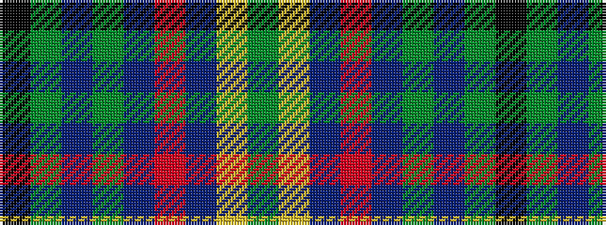

GYBRBGBGK

It is a 9 stripe tartan.

<figure class="pat-woven">

<figcaption>idealised sample</figcaption>
</figure>

## Colour Sequence



## Tartans with this colour sequence

| Tartans |
|---------------|
| [Blarney Castle](/setts/s9/g16lo3db9r3db9g6db3g3k3~x4/)|
||
