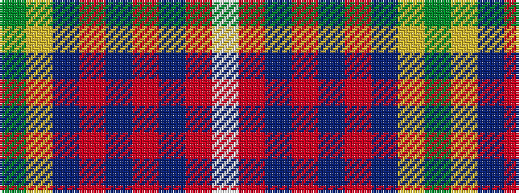

GYBRBRBRW

It is a 9 stripe tartan.

<figure class="pat-woven">

<figcaption>idealised sample</figcaption>
</figure>

## Colour Sequence



## Tartans with this colour sequence

| Tartans |
|---------------|
| [Tinkler (Corporate)](/setts/s9/g2lo9do6r3do2r3do2r10w2~x4/)|
||
