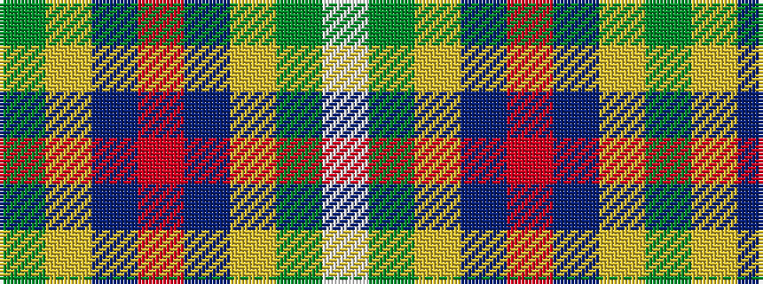

GYBRBYGW

It is a 8 stripe tartan.

<figure class="pat-woven">

<figcaption>idealised sample</figcaption>
</figure>

## Colour Sequence



## Tartans with this colour sequence

| Tartans |
|---------------|
| [Asher (Personal)](/setts/s8/dg40ly2db3r4db3ly2dg40w3~x2/)|
||
| [Asher (Personal)](/setts/s8/g40ly2db3r4db3ly2g40w3~x2/)|
||
