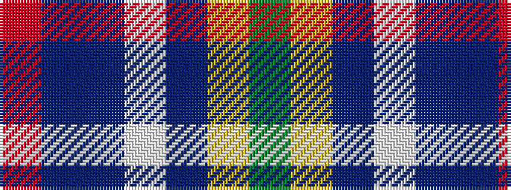

GYBWBBR

It is a 7 stripe tartan.

<figure class="pat-woven">

<figcaption>idealised sample</figcaption>
</figure>

## Colour Sequence



## Tartans with this colour sequence

| Tartans |
|---------------|
| [Porcupine City of](/variants/s7/r10n3db1lb8db1lo2g5~x4/)|
||
