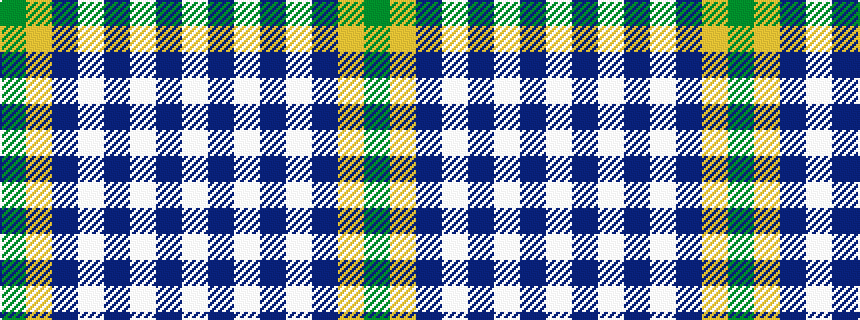

GYBWBWBW

It is a 8 stripe tartan.

<figure class="pat-woven">

<figcaption>idealised sample</figcaption>
</figure>

## Colour Sequence



## Tartans with this colour sequence

| Tartans |
|---------------|
| [Jackson (Personal)](/variants/s8/g5ly2dp40w1db15w1db1w1~x2/)|
||
