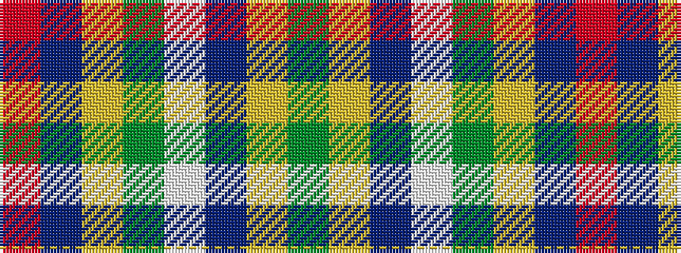

GYBWGYBR

It is a 8 stripe tartan.

<figure class="pat-woven">

<figcaption>idealised sample</figcaption>
</figure>

## Colour Sequence



## Tartans with this colour sequence

| Tartans |
|---------------|
| [Glasgow High (School)](/setts/s8/dy6ly3n42w4dg18ly2n12r3~x2/)|
||
