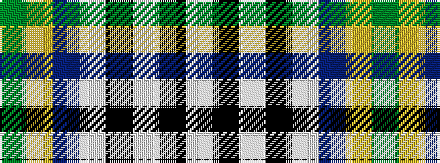

GYBWKWKW

It is a 8 stripe tartan.

<figure class="pat-woven">

<figcaption>idealised sample</figcaption>
</figure>

## Colour Sequence



## Tartans with this colour sequence

| Tartans |
|---------------|
| [Alexander Brothers - 2007? (Corp.)](/variants/s8/g5ly2t20w2k20w20k2w5~x2/)|
||
