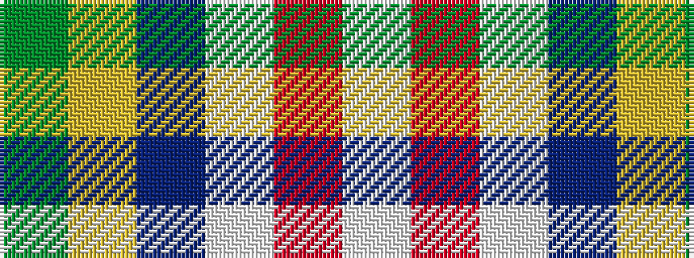

GYBWRW

It is a 6 stripe tartan.

<figure class="pat-woven">

<figcaption>idealised sample</figcaption>
</figure>

## Colour Sequence



## Tartans with this colour sequence

| Tartans |
|---------------|
| [Spencer (2013)](/setts/s6/dg55ly4db15w3r3w5~x2/)|
||
| [Spencer (2013)](/setts/s6/g55ly4db15w3r3w5~x2/)|
||
