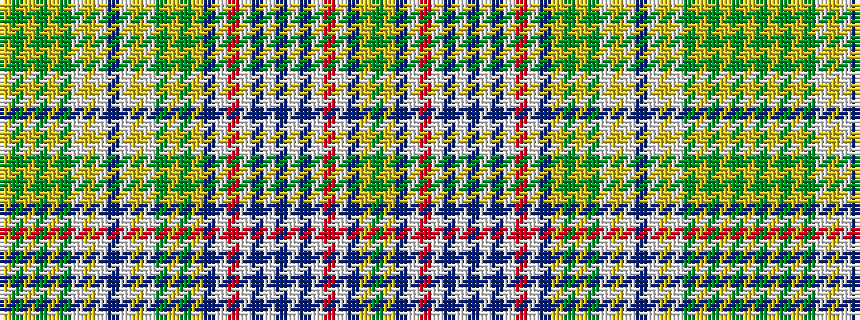

GYBWRWBWBWBWRWBYGYGWYWBWYWGYGYGY

It is a 32 stripe tartan.

<figure class="pat-woven">

<figcaption>idealised sample</figcaption>
</figure>

## Colour Sequence



## Tartans with this colour sequence

| Tartans |
|---------------|
| [Henry (2016)](/setts/s32/dg12ly1t1w1r2w1db1w1db4w1db1w1r2w1t1ly1dg12ly1dg1w1ly3w1db5w1ly3w1dg1ly1dg12ly1dg1ly1~x2/)|
||
