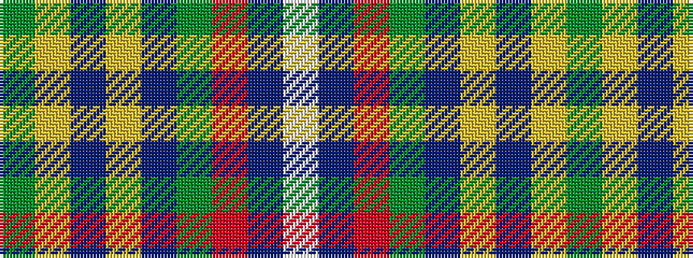

GYBYBGRBW

It is a 9 stripe tartan.

<figure class="pat-woven">

<figcaption>idealised sample</figcaption>
</figure>

## Colour Sequence



## Tartans with this colour sequence

| Tartans |
|---------------|
| [Casey of West Virginia (Personal)](/variants/s9/g4lo1dt1lo1dt2g9r1dt6w1~x4/)|
||
