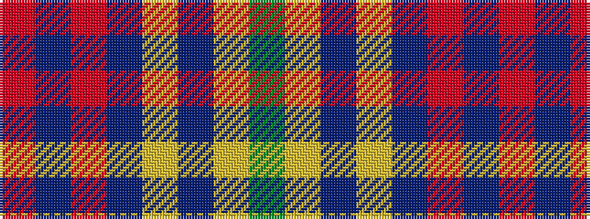

GYBYBRBR

It is a 8 stripe tartan.

<figure class="pat-woven">

<figcaption>idealised sample</figcaption>
</figure>

## Colour Sequence



## Tartans with this colour sequence

| Tartans |
|---------------|
| [Warren Wilson College (Corporate)](/variants/s8/g20lr6db20ly3db48r6db4r6~x2/)|
||
