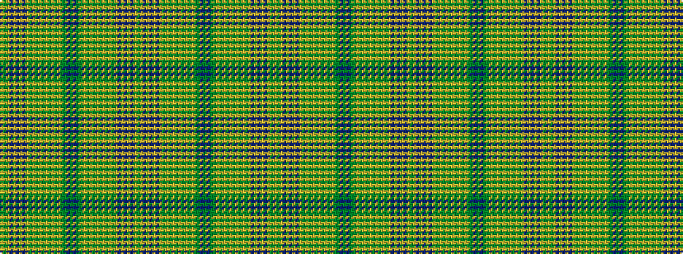

GYBYBYBYGYGYGYGYGYGGBGBGGYGYGYGYGYGYBYBYBYGY

It is a 44 stripe tartan.

<figure class="pat-woven">

<figcaption>idealised sample</figcaption>
</figure>

## Colour Sequence



## Tartans with this colour sequence

This pattern is a design lineage: every tartan below shares one colour order, whatever its owner —
near-identical designs are grouped, the largest lineage first (#112: the pattern is a tartan's
second parent, beside its family or clan).

<table class="sett-table">
<tbody>
<tr><td><a href="/variants/s44/dg4lr1n4lr1n3lr1n2lr1g4lr1g3lr1g2lr1y4lr1y3lr1y2dg3n2dg10n2dg3y2lr1y3lr1y4lr1g2lr1g3lr1g4lr1n2lr1n3lr1n4lr1dg4lr2~x4~dg1806142-g1903114/">Kirkton</a></td></tr>
<tr><td class="sett-swatch"></td></tr>
</tbody>
</table>

