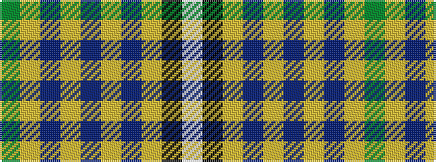

GYBYBYBYKW

It is a 10 stripe tartan.

<figure class="pat-woven">

<figcaption>idealised sample</figcaption>
</figure>

## Colour Sequence



## Tartans with this colour sequence

| Tartans |
|---------------|
| [Blalack](/setts/s10/g4lg2db14lg2db2lg2db2lg14k1w2~x2/)|
||
