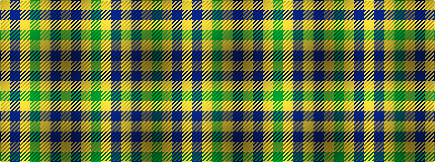

GYBYBYGYBY

It is a 10 stripe tartan.

<figure class="pat-woven">

<figcaption>idealised sample</figcaption>
</figure>

## Colour Sequence



## Tartans with this colour sequence

| Tartans |
|---------------|
| [Unidentified Printing #2](/variants/s10/dg3ly1db3ly1db3ly1dg3ly1db3ly1~x4/)|
||
